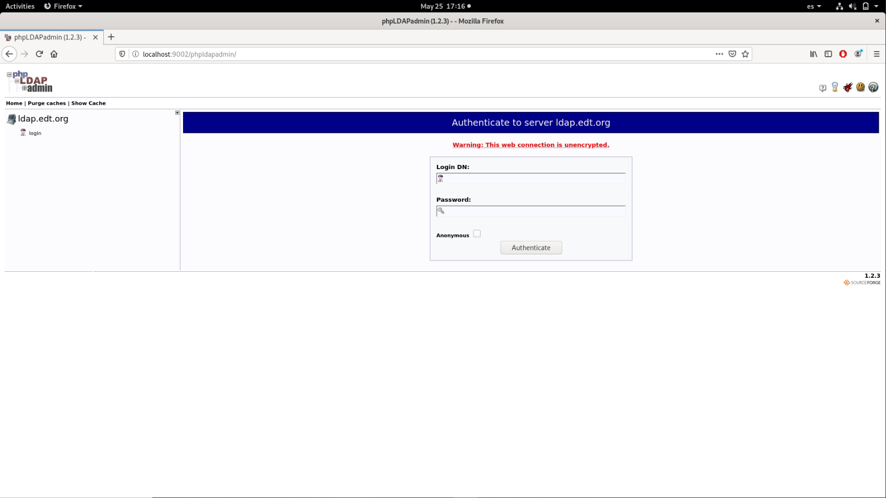

# Exemple 16: Ldap-local i phpldapadmin-remot

## INDEX

1. Servei Ldap
2. Túnel SSH Reverse
3. Servei Phpldapadmin
4. Visualització Phpldapadmin

- Objectiu: Obrir localment un ldap al host. Engegar al AWS un container phpldapadmin que usa el ldap del host de l’aula. Visualitzar localment al host de l’aula el phpldapadmin del
container de AWS EC2.

1. Servei Ldap

Primer de tot hem d'arrancar el servei ldap al host-local en detach. Utilitzarem un docker amb el servei Ldap creat ja anteriorment (adriaquintero61/ldapserver19:grup):

```
[adria@pc tunnelssh]$ docker run --rm -h ldap.edt.org --name ldap.edt.org -p 389:389 --net mynet -d adriaquintero61/ldapserver19:grup
4e26087350f5045ef7c59f83de919a713ab7eb16f79be35de76909aa271dce6a
```
Hem de tenir en compte que en el moment d'arrancar el docker, hem de fer que el port 389 del docker estigui publicat al 389 de la màquina on s'està executant, ja que sinó quan creem el túnel ssh no podrem indicar correctament el port del docker el qual pertany al servei ldap.

2. Túnel SSH Reverse

Un cop ja tenim el servei Ldap arrencat en segon pla, hem d'obrir el túnel reverse SSH des del nostre host local a la AMI d'Amazon. Aquest túnel ha d'anar lligat al servei ldap del host-local:

```
[adria@pc ~]$ ssh -R 0.0.0.0:9001:ldap.edt.org:389 -i .ssh/sshawskey.pem fedora@18.130.20.35
Last login: Sun May 24 17:49:16 2020 from 85.219.36.234
```

El "0.0.0.0" de l'inici de la direcció, el posem ja que d'aquesta manera el binding dels ports amb el túnel SSH serà a totes les interfícies. Per defecte si no es posa només és realitza amb localhost. Un cop establert el túnel, podem realitzar una comanda amb "ldapsearch" per tal de comprobar que funciona el servei ldap a través del túnel:

```
[fedora@june-ami ~]$ ldapsearch -x -LLL -h 127.0.0.1 -p 9001 -b "uid=user10,ou=usuaris,dc=edt,dc=org"
dn: uid=user10,ou=usuaris,dc=edt,dc=org
objectClass: posixAccount
objectClass: inetOrgPerson
cn: user10
cn: alumne10 de 2asix de todos los santos
sn: alumne10
homePhone: 555-222-0016
mail: user10@edt.org
description: alumne de 2asix
ou: 2asix
uid: user10
uidNumber: 7010
gidNumber: 1104
homeDirectory: /tmp/home/2asix/user10
userPassword:: e1NIQX1vdmY4dGEvcmVZUC91MnpqMGFmcEh0OHlFMUE9
```

3. Servei Phpldapadmin

Una vegada ja tenim el servei ldap funcionant a través del túnel ssh, engegarem el servei phpldapadmin en un container docker dins la màquina AMI:

```
[fedora@june-ami ~]$ docker run --rm --name php -h php --net mynet -it edtasixm06/phpldapadmin /bin/bash
[root@php /]# 
```

Dins el container de php, hem de configurar el fitxer "/etc/phpldapadmin/config.php" indicant-li la IP de la AMI (en aquest cas 18.132.41.150) i el port obert pel túnel ssh (9001):

```
[root@php /]# vi /etc/phpldapadmin/config.php

$servers->setValue('server','host','18.132.41.150');
...
$servers->setValue('server','port',9001);
```

Un cop configurat, hem d'executar les següents ordres per tal d'engegar el servei httpd:

```
[root@php /]# /usr/sbin/httpd
AH00558: httpd: Could not reliably determine the server's fully qualified domain name, using 172.19.0.2. Set the 'ServerName' directive globally to suppress this message

[root@php /]# /usr/sbin/httpd -S
AH00558: httpd: Could not reliably determine the server's fully qualified domain name, using 172.19.0.2. Set the 'ServerName' directive globally to suppress this message
VirtualHost configuration:
ServerRoot: "/etc/httpd"
Main DocumentRoot: "/var/www/html"
Main ErrorLog: "/etc/httpd/logs/error_log"
Mutex authdigest-opaque: using_defaults
Mutex watchdog-callback: using_defaults
Mutex proxy-balancer-shm: using_defaults
Mutex rewrite-map: using_defaults
Mutex authdigest-client: using_defaults
Mutex lua-ivm-shm: using_defaults
Mutex proxy: using_defaults
Mutex authn-socache: using_defaults
Mutex default: dir="/run/httpd/" mechanism=default 
Mutex mpm-accept: using_defaults
Mutex cache-socache: using_defaults
PidFile: "/run/httpd/httpd.pid"
Define: DUMP_VHOSTS
Define: DUMP_RUN_CFG
User: name="apache" id=48
Group: name="apache" id=48
```

4. Visualització phpldapadmin

Primer de tot, hem de configurar el fitxer /etc/hosts de la AMI per poder accedir mitjançant el nom del host (php) al port del servei phpldapadmin:

```
[fedora@june-ami ~]$ sudo vi /etc/hosts

127.0.0.1   localhost localhost.localdomain localhost4 localhost4.localdomain4
::1         localhost localhost.localdomain localhost6 localhost6.localdomain6
...
172.19.0.2 php
```

Un cop configurat, hem d'establir un túnel directe des del host-local al host-remot (phpldapadmin) mitjançant el host-destí (AMI):

```
[adria@pc ~]$ ssh -L 9002:php:80 -i .ssh/sshawskey.pem fedora@18.130.20.35
Last login: Sun May 24 20:24:07 2020 from 85.219.36.234
[fedora@june-ami ~]$
```

En quan tinguem establert el túnel, ja podem obrir un navegador i connectar-nos al phpldapadmin mitjançant el port que hem utilitzat per establit el túnel amb el phpldapadmin (en aquest cas, http://localhost:9002/phpldapadmin):


