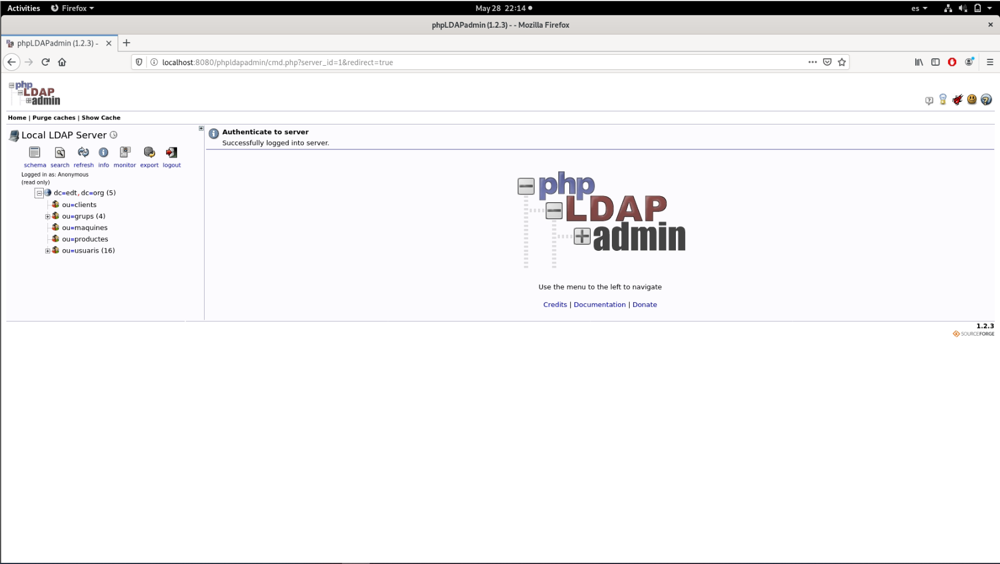
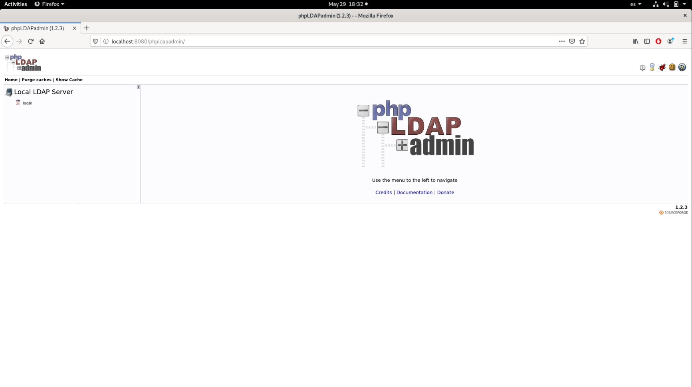
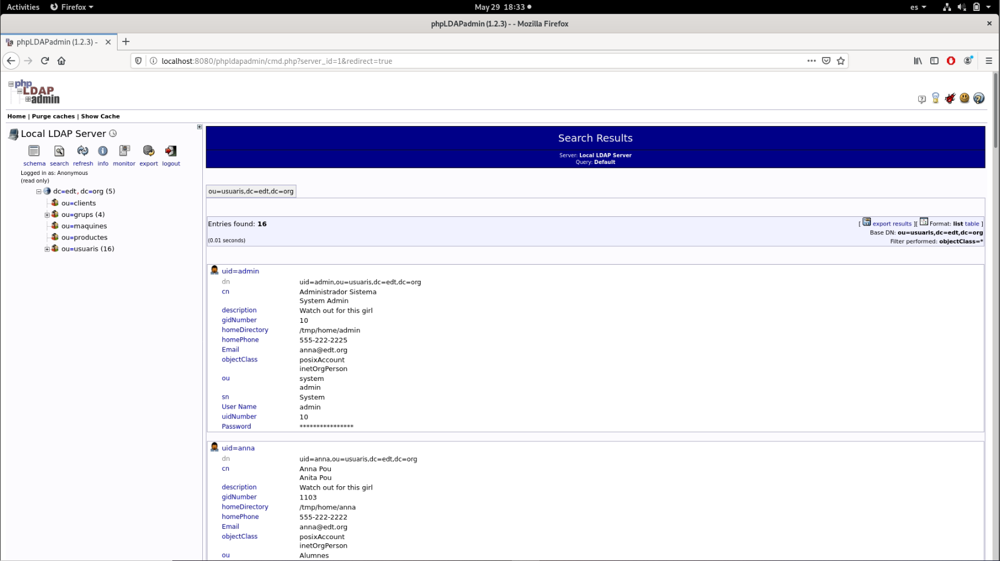

# Pràctica Tunnel-SSH

## INDEX:

- [Exemple 15: Ldap-remot i phpldapadmin-local](#Exemple-15-Ldap-remot-i-phpldapadmin-local)

- [Exemple 16: Ldap-local i phpldapadmin-remot](#Exemple-16-Ldap-local-i-phpldapadmin-remot)

# Exemple 15: Ldap-remot i phpldapadmin-local

- Objectiu: Desplegem dins d’un container Docker (host-remot) en una AMI (host-destí) el servei ldap amb el firewall de la AMI només obrint el port 22. Localment al host de l’aula (host-local) desplegem un container amb phpldapadmin. Aquest container ha de poder accedir a les dades ldap. des del host de l’aula volem poder visualitzar el phpldapadmin.

## Desplegar el servei Ldap:

- Primer de tot, despleguem en el host-remot (AMI) un container Ldap sense fer map dels ports. En aquest cas l'executem de manera interactiva per poder modificar el valor "ulimit" abans d'executar-lo:

```
[fedora@june-ami ~]$ docker run --rm -h ldap.edt.org --name ldap.edt.org --net mynet -it adriaquintero61/ldapserver19:grup /bin/bash
[root@ldap docker]# ulimit -n 4096
[root@ldap docker]# bash startup.sh 
5ed00760 mdb_db_open: database "dc=edt,dc=org" cannot be opened: No such file or directory (2). Restore from backup!
5ed00760 backend_startup_one (type=mdb, suffix="dc=edt,dc=org"): bi_db_open failed! (2)
slap_startup failed (test would succeed using the -u switch)
_#################### 100.00% eta   none elapsed            none fast!         
Closing DB...

```

- Un cop hem arrancat el servei Ldap, revisem que la AMI només té obert el port 22:

```
[fedora@june-ami ~]$ nmap localhost
Starting Nmap 7.70 ( https://nmap.org ) at 2020-05-28 18:50 UTC
Nmap scan report for localhost (127.0.0.1)
Host is up (0.00042s latency).
Other addresses for localhost (not scanned): ::1
Not shown: 999 closed ports
PORT   STATE SERVICE
22/tcp open  ssh

Nmap done: 1 IP address (1 host up) scanned in 0.09 seconds
```

- Una vegada hem comprobat que només el port 22 està obert, configurem el fitxer "/etc/hosts" de la AMI per poder accedir al container ldap per nom de host:

```
[fedora@june-ami ~]$ cat /etc/hosts
127.0.0.1   localhost localhost.localdomain localhost4 localhost4.localdomain4
::1         localhost localhost.localdomain localhost6 localhost6.localdomain6
172.18.0.2 ldap.edt.org
```

- Un cop configurat, comprovem que desde el host de l'aula (host-local) podem fer consultes ldap:

```
[adria@pc ~]$ ssh -i .ssh/sshawskey.pem -L 9001:ldap.edt.org:389 fedora@35.178.42.0
Last login: Thu May 28 18:49:47 2020 from 85.219.36.234
```
- Un cop establert el túnel, comprovem a fer una consulta Ldap:

```
[adria@pc ~]$ ldapsearch -x -LLL -h localhost -p 9001 -b 'dc=edt,dc=org' | tail -n16
dn: uid=user10,ou=usuaris,dc=edt,dc=org
objectClass: posixAccount
objectClass: inetOrgPerson
cn: user10
cn: alumne10 de 2asix de todos los santos
sn: alumne10
homePhone: 555-222-0016
mail: user10@edt.org
description: alumne de 2asix
ou: 2asix
uid: user10
uidNumber: 7010
gidNumber: 1104
homeDirectory: /tmp/home/2asix/user10
userPassword:: e1NIQX1vdmY4dGEvcmVZUC91MnpqMGFmcEh0OHlFMUE9
```

## Desplegar el servei phpldapadmin:

- Per començar, hem d'engegar en le host de l'aula (host-local) un container docker amb el servei phpldapadmin fent map del seu port 8080 al host-local:

```
[adria@pc ~]$ docker run --rm -h phpldapadmin --name phpldapadmin -p 8080:80 --net mynet -it docker.io/edtasixm06/phpldapadmin /bin/bash
[root@phpldapadmin /]#
```

- Una vegada arrencat el phpldapadmin, creem el túnel directe ssh des del host de l'aula (host-local) al servei ldap (host-remot) connectant via SSH al host AMI (host-destí):

```
[adria@pc ~]$ ssh -i .ssh/sshawskey.pem -L 172.18.0.1:9001:ldap.edt.org:389 fedora@35.178.42.0
Last login: Thu May 28 20:03:36 2020 from 85.219.36.234
[fedora@june-ami ~]$
```

- Un cop tenim el túnel SSH establert, hem de configurar el phpldapadmin per que trobi la base de dades Ldap accedint al host de l'aula al port acabat de crear amb el túnel directe ssh:

```
[root@phpldapadmin /]# vi /etc/phpldapadmin/config.php

$servers->setValue('server','host','172.18.0.1');
$servers->setValue('server','port',9001);
$servers->setValue('server','base',array('dc=edt,dc=org'));
```

- Quan ja tenim el servei configurat, executem el servei httpd per poder accedir al phpldapadmin:

```
[root@phpldapadmin /]# /usr/sbin/httpd
AH00558: httpd: Could not reliably determine the server's fully qualified domain name, using 172.19.0.2. Set the 'ServerName' directive globally to suppress this message
[root@phpldapadmin /]# /usr/sbin/httpd -S
AH00558: httpd: Could not reliably determine the server's fully qualified domain name, using 172.19.0.2. Set the 'ServerName' directive globally to suppress this message
VirtualHost configuration:
ServerRoot: "/etc/httpd"
...
User: name="apache" id=48
Group: name="apache" id=48
```

- Un cop configurat i executat, ja podem visualitzar des del host de l’aula el servei phpldapadmin, accedint al port 8080 del container phpldapadmin o al port que hem fet map del host de l’aula:


- Iniciem sessió amb l'usuari "anonymous" i comprovem que podem veure la Base de dades Ldap:




# Exemple 16: Ldap-local i phpldapadmin-remot

- Objectiu: Obrir localment un ldap al host. Engegar al AWS un container phpldapadmin que usa el ldap del host de l’aula. Visualitzar localment al host de l’aula el phpldapadmin del container de AWS EC2.

## Engegar ldap i phpldapadmin i que tinguin connectivitat:

- Per començar, engeguem localment el servei ldap al host-local de l’aula:

```
[adria@pc ~]$ docker run --rm -h ldap.edt.org --name ldap.edt.org -p 389:389 --net mynet -d adriaquintero61/ldapserver19:grup
51c2d4f7ee5717074b31298d361ff06e87f53499d93b615dd9b05dc44164197d

[adria@pc ~]$ docker ps
CONTAINER ID        IMAGE                               COMMAND                  CREATED             STATUS              PORTS                  NAMES
51c2d4f7ee57        adriaquintero61/ldapserver19:grup   "/bin/sh -c /opt/d..."   5 seconds ago       Up 2 seconds        0.0.0.0:389->389/tcp   ldap.edt.org
```

- Després. obrim un túnel invers SSH en la AMI de AWS EC2 (host-destí) lligat al servei ldap del host-local de l’aula. Abans d'obrir el túnel invers, ens hem d'assegurar que el servidor SSHD de la AMI està ben configurat per tal de que el "binding" dels ports es realitzi a altres interfícies que no siguin la localhost:

- Per tal de configurar el servidor sshd, hem de modificar la directiva "GatewayPorts" del fitxer "/etc/ssh/sshd_config" per tal de que quedi de la següent forma:

```
[fedora@june-ami ~]$ sudo vim /etc/ssh/sshd_config

...
#AllowTcpForwarding yes
GatewayPorts yes
X11Forwarding yes
#X11DisplayOffset 10
#X11UseLocalhost yes
...
```

- Un cop modificat, hem de reiniciar el servei perque s'apliquin els canvis:

```
[fedora@june-ami ~]$ sudo vim /etc/ssh/sshd_config
```

- Un cop ja hem reiniciat el servei sshd, ja podem obrir el túnel invers:

```
[adria@pc ~]$ ssh -i .ssh/sshawskey.pem -R 172.18.0.1:9001:172.18.0.2:389 fedora@3.9.176.71
Last login: Fri May 29 15:56:09 2020 from 85.219.36.234
[fedora@june-ami ~]$
```

- Un cop establert el túnel, podem atacar la IP de la xarxa del docker i el port obert pel túnel SSH per comprovar que funciona:

```
[fedora@june-ami ~]$ ldapsearch -x -LLL -h 172.18.0.1 -p 9001 -b 'uid=anna,ou=usuaris,dc=edt,dc=org'
dn: uid=anna,ou=usuaris,dc=edt,dc=org
objectClass: posixAccount
objectClass: inetOrgPerson
cn: Anna Pou
cn: Anita Pou
sn: Pou
homePhone: 555-222-2222
mail: anna@edt.org
description: Watch out for this girl
ou: Alumnes
uid: anna
uidNumber: 5002
gidNumber: 1103
homeDirectory: /tmp/home/anna
userPassword:: e1NTSEF9Qm00QjNCdS9mdUg2QmJ5OWxneGZGQXdMWXJLMFJiT3E=
```

- Ara cal engegar el servei phpldapadmin en un container Docker dins de la màquina AMI. Cal configurar-lo perquè connecti al servidor ldap indicant-li la ip de la AMI i el port obert per el túnel SSH:

```
[fedora@june-ami ~]$ docker run --rm -h php --name php --net mynet -it edtasixm06/phpldapadmin:latest
[root@php /]# vi /etc/phpldapadmin/config.php

...
$servers->setValue('server','host','172.18.0.1');

/* The port your LDAP server listens on (no quotes). 389 is standard. */
$servers->setValue('server','port',9001);

/* Array of base DNs of your LDAP server. Leave this blank to have phpLDAPadmin
   auto-detect it for you. */
$servers->setValue('server','base',array('dc=edt,dc=org'));
...
```

- Un cop configurat arranquem el servei httpd:

```
[root@php /]# /usr/sbin/httpd
AH00558: httpd: Could not reliably determine the server's fully qualified domain name, using 172.18.0.2. Set the 'ServerName' directive globally to suppress this message
[root@php /]# /usr/sbin/httpd -S
AH00558: httpd: Could not reliably determine the server's fully qualified domain name, using 172.18.0.2. Set the 'ServerName' directive globally to suppress this message
...
User: name="apache" id=48
Group: name="apache" id=48
```

## Accedir al phpldapadmin

- Ara cal accedir des del host de l’aula al port 8080 del phpldapadmin per visualitzar-lo. Per fer-ho cal:

- En la AMI configurar el /etc/hosts per poder accedir per nom de host (per exemple php) al port apropiat del servei phpldapadmin:

```
[fedora@june-ami ~]$ cat /etc/hosts
127.0.0.1   localhost localhost.localdomain localhost4 localhost4.localdomain4
::1         localhost localhost.localdomain localhost6 localhost6.localdomain6
172.18.0.2 php
```

- Establir un túnel directe del host de l’aula (host-local) al host-remot phpldapadmin passant pel host-destí (la AMI):

```
[adria@pc ~]$ ssh -i .ssh/sshawskey.pem -L 8080:php:80 fedora@3.9.176.71
Last login: Fri May 29 16:19:41 2020 from 85.219.36.234
[fedora@june-ami ~]$ 
```

- Ara amb un navegador ja podem visualitzar localment des del host de l’aula el phpldapadmin connectant al port directe acabat de crear:



- Accedim al servidor amb l'usuari "Anonymous" i comprovem que podem visualitzar les dades del servidor Ldap:

